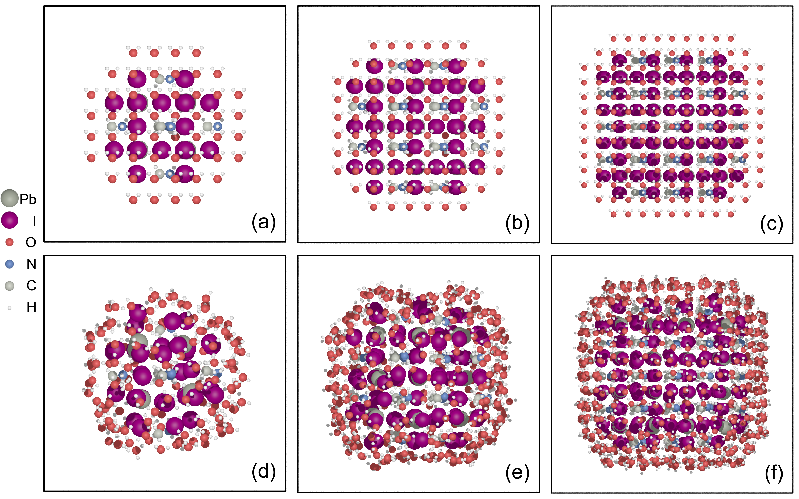

# MAPbI3-Water
Source codes for the paper: [**Mechanism of Interaction of Water above the Methylammonium Lead Iodide Perovskite Nanocluster: Size Effect and Water-Induced Defective States**](https://doi.org/10.1021/acs.jpclett.3c02807)



## Citation
Cite as: 
> Jie Huang, Bowen Wang, Hejin Yan, and Yongqing Cai, The Journal of Physical Chemistry Letters 2024 15 (2), 575-582, DOI: 10.1021/acs.jpclett.3c02807

Or
```
@article{Huang2024,
  title = {Mechanism of Interaction of Water above the Methylammonium Lead Iodide Perovskite Nanocluster: Size Effect and Water-Induced Defective States},
  volume = {15},
  ISSN = {1948-7185},
  url = {http://dx.doi.org/10.1021/acs.jpclett.3c02807},
  DOI = {10.1021/acs.jpclett.3c02807},
  number = {2},
  journal = {The Journal of Physical Chemistry Letters},
  publisher = {American Chemical Society (ACS)},
  author = {Huang,  Jie and Wang,  Bowen and Yan,  Hejin and Cai,  Yongqing},
  year = {2024},
  month = jan,
  pages = {575–582}
}
```
